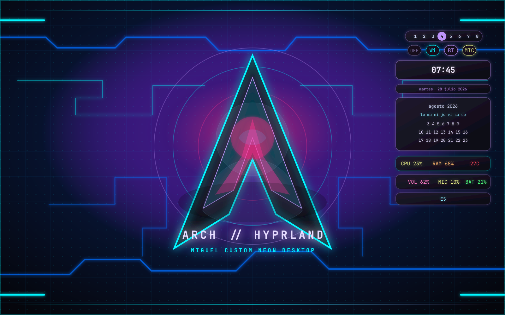

# arch-hyprland-dotfiles — Miguel

Configuración personal de Hyprland para mi PC, con estética neon cyan/lila, centro de control Waybar, alertas de batería y widgets integrados. Todo hecho a mi medida y con mis reglas.



## Features

### Hyprland
- Custom animations (overshot, smooth transitions, slide vertical)
- Theme variables for quick accent customization
- Rounded corners (10px), dim inactive windows (10%)
- High-performance blur with optimization flags
- Swaync notification daemon with custom CSS (critical notifications in red)

### Waybar — Triple-Bar Widget System

Three independent Waybar instances toggled via `SUPER+W`:

| Bar | Position | Contents |
|-----|----------|----------|
| **widgets** | Right overlay | Clock, date, navigable calendar, system summary (CPU/RAM/disk), control summary (WiFi/BT/Mic/sound/language) |
| **quick-controls** | Top center | Native clickable workspaces (hyprland/workspaces) |
| **quick-buttons** | Top center | Idle toggle, WiFi, Bluetooth, Mic — each with independent actions |

All bars use `layer: overlay` with `exclusive: false` so they float without displacing windows.

### Battery Alert Monitor (`battery-alert.sh`)
Three-tier notifications via swaync:
- **20%** — Normal notification (dismissable, cyan)
- **15%** — Normal notification (dismissable, cyan)
- **10%** — Critical notification (RED, non-expiring, re-sent every 10s if dismissed)
- Auto-resets when charger is connected

### Idle Toggle (`idle-toggle.sh`)
- Eye icon in quick-buttons bar (next to WiFi)
- Kills/restarts `hypridle` on click
- Green (active) = screen stays on; Gray (inactive) = screen sleeps normally

### Terminal Themes
- **Ghostty**: JetBrainsMono Nerd Font, cyan cursor, 80% opacity, custom neon palette
- **Kitty**: Same palette, beam cursor, active/inactive border colors
- **btop**: Custom `synthwave-neon.theme` with cyan/lila gradient

### Wofi
- Centered launcher with neon styling
- 720×520, term set to kitty

## Structure

```
├── btop/           # System monitor config + synthwave-neon theme
├── ghostty/        # Ghostty terminal config
├── hypr/           # Hyprland, hypridle, hyprlock, hyprpaper
├── kitty/          # Kitty terminal config
├── waybar/         # Three-bar widget system
│   ├── widgets.jsonc      # Main right panel
│   ├── quick-controls.jsonc  # Workspace row
│   ├── quick-buttons.jsonc   # Idle/WiFi/BT/Mic row
│   ├── modules.json         # Shared module definitions
│   ├── scripts/             # Calendar, network, bluetooth, toggle, battery, idle
│   └── *.css                # Per-bar stylesheets
├── wofi/           # App launcher config
├── zsh/            # Shell config + aliases
└── spec/           # SDD feature specifications
```

## Quick Setup

```bash
mkdir -p ~/dev/config
git clone https://github.com/Rukawua26/arch-hyprland-dotfiles.git ~/dev/config/dotfiles
cd ~/dev/config/dotfiles
./install.sh
```

## Dependencies

- **WM**: Hyprland, hypridle, hyprlock, hyprpaper, hyprctl
- **Bar**: Waybar (≥0.10)
- **Notifications**: swaync, notify-send
- **Launcher**: wofi
- **Utilities**: upower, brightnessctl, pulseaudio/pavucontrol, bluetoothctl
- **Scripts**: bash, pgrep, date, printf
